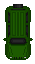
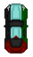

<div align="center">
  <h1>🏎️ Lane Escape Car Game 🏎️</h1>
  <p><em>Experience the thrill of retro arcade racing right in your browser!</em></p>
  <p align="center">
  <a href="https://sasi-upparapalli.github.io/Lane-Escape/" target="_blank">
    
  </a>
</p>

[](https://postimg.cc/V0tXkWbt)
  
  <p>
    
    
    
  </p>
</div>

---

## ✨ Features

🎮 **Multi-Level Gameplay** - Choose from Easy, Medium, and Hard difficulty levels  
📱 **Mobile Responsive** - Touch controls for mobile devices  
🎨 **Retro Arcade Style** - Beautiful pixel-perfect graphics with classic fonts  
🏆 **High Score System** - Track your best scores per level and username  
⚡ **Smooth Animations** - Fluid car movements and dynamic opponent spawning  
🎵 **Interactive UI** - Font Awesome icons and modern design elements  
👤 **User Profiles** - Personalized experience with username tracking  

---

## 🎯 How to Play

1. **Enter Username** - Start by entering your player name
2. **Select Level** - Choose your difficulty:
   - 🟢 **Level 1**: Easy - Slow opponents, perfect for beginners
   - 🟡 **Level 2**: Medium - Moderate speed challenge  
   - 🔴 **Level 3**: Hard - Fast opponents, ultimate test of reflexes
3. **Avoid Traffic** - Use arrow keys (or touch controls) to dodge incoming cars
4. **Beat Your High Score** - Try to achieve the highest score possible!

---

## 🎮 Controls

### Desktop
- **⬅️ Left Arrow** - Move car left
- **➡️ Right Arrow** - Move car right  
- **P Key** - Pause/Resume game

### Mobile
- **⬅️ Left Button** - Move car left
- **➡️ Right Button** - Move car right
- Touch the game area to focus controls

---

## 🚀 Quick Start

### Method 1: Direct Play
1. Download or clone this repository
2. Open `index.html` in any modern web browser
3. Start playing immediately!

### Method 2: Clone Repository
```bash
git clone https://github.com/your-username/single-screen-car-game.git
cd single-screen-car-game
# Open index.html in browser
```

---

## 📁 Project Structure

```
single-screen-car-game/
│
├── index.html                 # Main game interface
├── style.css                  # Styling and responsive design
├── script.js                  # Game logic and controls
├── assets/                    # Game assets folder
│   ├── player1.png           # Player car (Level 1)
│   ├── player2.png           # Player car (Level 2) 
│   ├── player3.png           # Player car (Level 3)
│   ├── opponent1.png         # Opponent cars
│   ├── opponent2.png         # (12 different opponent
│   └── ...opponent12.png     # car designs available)
└── README.md                 # This file
```

---

## 🎨 Design Features

### Fonts & Typography
- **Press Start 2P** - Retro gaming headers
- **Kanit** - Modern interface text
- **Silkscreen** - Pixel-perfect details
- **Varela Round** - Smooth readable text

### Color Palette
- **Primary**: `#3ee3b3` (Bright teal accent)
- **Gold**: `#FFD700` (Highlighting elements)
- **Background**: `#071123` (Deep space blue)
- **Text**: `#e6eef8` (Clean white-blue)

### Icons & Assets
- **Font Awesome 4.7.0 & 6.4.2** for UI icons
- **12 Unique Opponent Cars** with pixel art style
- **3 Player Cars** (one for each difficulty level)

---

## 📊 Game Mechanics

### Scoring System
- **Base Score**: 10 points per second survived
- **Speed Multiplier**: 
  - Level 1: 1.45x
  - Level 2: 1.45x  
  - Level 3: 1.8x
- **High Scores**: Stored locally per user and level

### Difficulty Levels
| Level | Opponent Count | Speed | Spawn Rate | Max Opponents |
|-------|---------------|--------|------------|---------------|
| 1 (Easy) | 4 | 1.45x | 1500ms | 4 |
| 2 (Medium) | 5 | 1.45x | 600ms | 5 |
| 3 (Hard) | 6 | 1.8x | 600ms | 6 |

---

## 🖼️ Screenshots & Demo

[](https://postimg.cc/8JvYr5sf)

## 🎭 About Section

The game pays homage to classic arcade racers:

### Historical Inspiration
- **Gran Trak 10 (1974)** - First arcade racing game with steering wheel controls
- **Pole Position (1982)** - Introduced real-world racing circuits and third-person perspective

Learn more about gaming history in the built-in "About" section!

---

## 🌐 Social Links

Connect with the developer:

[](https://www.linkedin.com/in/sasiupparapalli28/)
[](https://github.com/sasi-upparapalli)
[](https://twitter.com/spicysasi)
[](https://www.instagram.com/____sasi____upparapalli____)
[](mailto:sasikanthupparapalli@gmail.com)

---

## 🔧 Technical Details

### Browser Compatibility
- ✅ Chrome 80+
- ✅ Firefox 75+  
- ✅ Safari 13+
- ✅ Edge 80+
- ✅ Mobile browsers (iOS Safari, Chrome Mobile)

### Performance Features
- **Optimized Animations** using `requestAnimationFrame`
- **Efficient Collision Detection** with bounding box calculations
- **Memory Management** for opponent sprites
- **Responsive Scaling** for different screen sizes

---

## 🤝 Contributing

Contributions are welcome! Here's how you can help:

1. **Fork** the repository
2. **Create** a feature branch (`git checkout -b feature/AmazingFeature`)
3. **Commit** your changes (`git commit -m 'Add some AmazingFeature'`)
4. **Push** to the branch (`git push origin feature/AmazingFeature`)
5. **Open** a Pull Request

### Ideas for Contribution
- 🎨 New car designs and sprites
- 🎵 Sound effects and background music
- 🏆 Power-ups and special abilities
- 🌟 New game modes (time attack, survival)
- 🎮 Gamepad controller support

---

## 📋 Roadmap

### Planned Features
- [ ] **Sound System** - Engine sounds and collision effects
- [ ] **Power-ups** - Speed boost, invincibility, extra points
- [ ] **Leaderboards** - Online high score sharing
- [ ] **More Levels** - Additional difficulty tiers
- [ ] **Car Customization** - Player car color/style options
- [ ] **Weather Effects** - Rain, fog, night mode

---

## 🐛 Known Issues

- Mobile touch controls may need calibration on some devices
- High scores reset when browser data is cleared
- Performance may vary on older mobile devices


---

## 🎉 Acknowledgments

- **Font Awesome** for the beautiful icons
- **Google Fonts** for typography
- **Classic Arcade Games** for inspiration
- **Open Source Community** for tools and resources

---

<div align="center">
  <h3>🏁 Ready to Race? Start Your Engines! 🏁</h3>
  <p><em>May the best driver win!</em></p>
  
  
  
  
  
  
</div>

---

<div align="center">
  <sub>Built with ❤️ by <a href="https://github.com/sasi-upparapalli">Sasi Upparapalli</a></sub>
</div>
